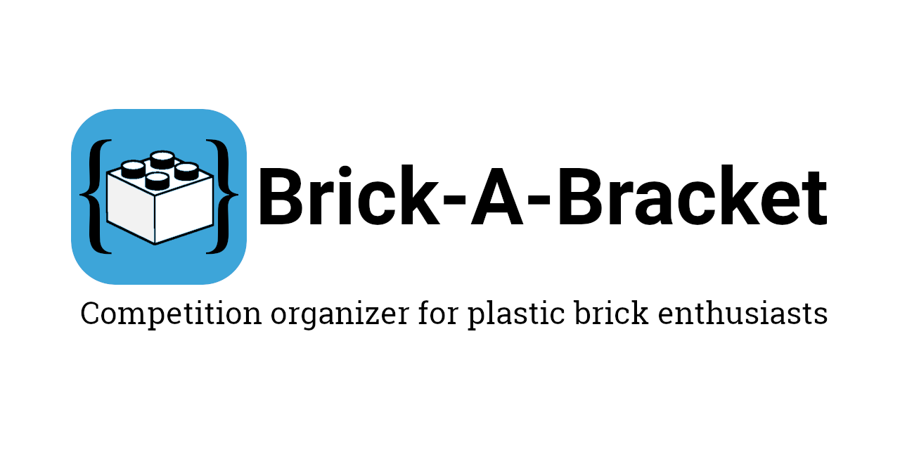

# Brick-a-Bracket



## Requirements

Brick-a-Bracket requires the following in order to run:

- .NET Core >= 2.2.102
- Node.JS >= 10.15.0

The software is known to run on Raspberry Pi (Raspbian OS) and Windows 10. Please let me know if you get it running in other environments.

## Supported Competition Types

- Derby (4 lanes)
- Single Elimination
- Round Robin (in development)
- Swiss System (in development)

## Connecting your NXTs

More information soon...

## Development

Development requires .NET Core SDK version 2.2.102 and Node.js version 10.15.0 or better.

To initialize development environment, run the following from a terminal:

``` bash
cd BrickABracket
dotnet restore
cd ClientApp
npm install
```
